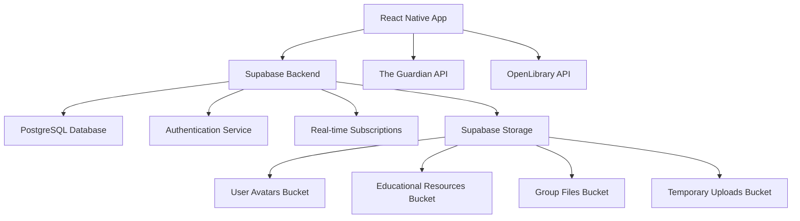

# Design Document

## Overview

The Ghana Education App is a React Native mobile application built with Expo that provides students with a comprehensive digital learning platform. The app addresses local educational challenges by offering study group coordination, resource sharing, progress tracking, and access to educational content through free and open-source APIs.

### UI Design Reference
- **Figma Design**: https://www.figma.com/design/UDI2EwedkmGEaKVUJSatbT/Untitled?node-id=0-1&t=zNuhRvGrmrLQnQ6d-1
- **Design System**: Clean, modern interface with intuitive navigation
- **Implementation Note**: All UI components must match the exact specifications from the Figma design

### Key Technologies
- **Frontend**: React Native with Expo
- **Backend**: Supabase (authentication, database, real-time features)
- **Third-party APIs**: The Guardian Open Platform API, OpenLibrary API
- **State Management**: React Context API with useReducer
- **Navigation**: React Navigation v6
- **UI Components**: React Native Elements or NativeBase

## Architecture

### High-Level Architecture



### Application Structure

```
src/
├── components/           # Reusable UI components
├── screens/             # Screen components for navigation
├── navigation/          # Navigation configuration
├── services/           # API services and external integrations
├── context/            # React Context for state management
├── utils/              # Helper functions and utilities
├── hooks/              # Custom React hooks
├── types/              # TypeScript type definitions
└── constants/          # App constants and configuration
```

## Components and Interfaces

### Core Components

#### 1. Authentication Components
- **LoginScreen**: Email/password login with validation
- **RegisterScreen**: User registration with email verification
- **ForgotPasswordScreen**: Password reset functionality
- **AuthProvider**: Context provider for authentication state

#### 2. Navigation Components
- **TabNavigator**: Bottom tab navigation with 4 main tabs
- **StackNavigator**: Screen navigation within each tab
- **AuthNavigator**: Conditional navigation based on auth state

#### 3. Home Screen Components
- **DashboardCard**: Progress tracking and statistics
- **NewsCard**: Educational news from The Guardian API
- **FeaturedBooksCard**: Featured educational resources from OpenLibrary
- **QuickActionsCard**: Shortcuts to common features

#### 4. Resources Components
- **ResourceList**: Display categorized educational materials
- **SearchBar**: Search functionality for resources
- **BookmarkButton**: Save/unsave resources
- **UploadModal**: Upload study materials
- **ResourceCard**: Individual resource display

#### 5. Study Groups Components
- **GroupList**: Display available study groups
- **GroupCard**: Individual group information
- **CreateGroupModal**: Form to create new study groups
- **GroupChat**: Messaging interface for group members
- **MembersList**: Display group participants

#### 6. Profile Components
- **ProfileHeader**: User information and avatar
- **ProgressChart**: Visual progress tracking
- **SettingsMenu**: App preferences and account settings
- **AchievementsBadges**: User accomplishments display

### API Interfaces

#### Supabase Database Schema

```sql
-- Users table (extends Supabase auth.users)
CREATE TABLE profiles (
  id UUID REFERENCES auth.users PRIMARY KEY,
  username TEXT UNIQUE,
  full_name TEXT,
  avatar_url TEXT,
  school TEXT,
  grade_level TEXT,
  subjects_of_interest TEXT[],
  storage_used BIGINT DEFAULT 0, -- Storage usage in bytes
  storage_limit BIGINT DEFAULT 104857600, -- 100MB default limit
  created_at TIMESTAMP WITH TIME ZONE DEFAULT NOW(),
  updated_at TIMESTAMP WITH TIME ZONE DEFAULT NOW()
);

-- Study Groups table
CREATE TABLE study_groups (
  id UUID DEFAULT gen_random_uuid() PRIMARY KEY,
  name TEXT NOT NULL,
  description TEXT,
  subject TEXT NOT NULL,
  privacy_level TEXT CHECK (privacy_level IN ('public', 'private')) DEFAULT 'public',
  max_members INTEGER DEFAULT 20,
  created_by UUID REFERENCES profiles(id),
  created_at TIMESTAMP WITH TIME ZONE DEFAULT NOW(),
  updated_at TIMESTAMP WITH TIME ZONE DEFAULT NOW()
);

-- Group Members table
CREATE TABLE group_members (
  id UUID DEFAULT gen_random_uuid() PRIMARY KEY,
  group_id UUID REFERENCES study_groups(id) ON DELETE CASCADE,
  user_id UUID REFERENCES profiles(id) ON DELETE CASCADE,
  role TEXT CHECK (role IN ('admin', 'member')) DEFAULT 'member',
  joined_at TIMESTAMP WITH TIME ZONE DEFAULT NOW(),
  UNIQUE(group_id, user_id)
);

-- Resources table
CREATE TABLE resources (
  id UUID DEFAULT gen_random_uuid() PRIMARY KEY,
  title TEXT NOT NULL,
  description TEXT,
  resource_type TEXT CHECK (resource_type IN ('document', 'link', 'video', 'book', 'image')),
  file_url TEXT,
  file_path TEXT, -- Storage path for Supabase Storage
  file_size BIGINT, -- File size in bytes
  file_type TEXT, -- MIME type
  thumbnail_url TEXT, -- Generated thumbnail for images/videos
  external_url TEXT,
  subject TEXT,
  grade_level TEXT,
  uploaded_by UUID REFERENCES profiles(id),
  is_public BOOLEAN DEFAULT true,
  download_count INTEGER DEFAULT 0,
  created_at TIMESTAMP WITH TIME ZONE DEFAULT NOW(),
  updated_at TIMESTAMP WITH TIME ZONE DEFAULT NOW()
);

-- Bookmarks table
CREATE TABLE bookmarks (
  id UUID DEFAULT gen_random_uuid() PRIMARY KEY,
  user_id UUID REFERENCES profiles(id) ON DELETE CASCADE,
  resource_id UUID REFERENCES resources(id) ON DELETE CASCADE,
  created_at TIMESTAMP WITH TIME ZONE DEFAULT NOW(),
  UNIQUE(user_id, resource_id)
);

-- Progress Tracking table
CREATE TABLE user_progress (
  id UUID DEFAULT gen_random_uuid() PRIMARY KEY,
  user_id UUID REFERENCES profiles(id) ON DELETE CASCADE,
  activity_type TEXT NOT NULL,
  activity_data JSONB,
  points_earned INTEGER DEFAULT 0,
  completed_at TIMESTAMP WITH TIME ZONE DEFAULT NOW()
);

-- Group Messages table
CREATE TABLE group_messages (
  id UUID DEFAULT gen_random_uuid() PRIMARY KEY,
  group_id UUID REFERENCES study_groups(id) ON DELETE CASCADE,
  sender_id UUID REFERENCES profiles(id) ON DELETE CASCADE,
  message_text TEXT,
  message_type TEXT CHECK (message_type IN ('text', 'file', 'image', 'video', 'document')) DEFAULT 'text',
  file_url TEXT,
  file_path TEXT, -- Storage path for Supabase Storage
  file_name TEXT, -- Original filename
  file_size BIGINT, -- File size in bytes
  file_type TEXT, -- MIME type
  thumbnail_url TEXT, -- Generated thumbnail for media files
  created_at TIMESTAMP WITH TIME ZONE DEFAULT NOW()
);

-- File uploads tracking table
CREATE TABLE file_uploads (
  id UUID DEFAULT gen_random_uuid() PRIMARY KEY,
  user_id UUID REFERENCES profiles(id) ON DELETE CASCADE,
  file_path TEXT NOT NULL,
  file_name TEXT NOT NULL,
  file_size BIGINT NOT NULL,
  file_type TEXT NOT NULL,
  bucket_name TEXT NOT NULL,
  upload_status TEXT CHECK (upload_status IN ('pending', 'completed', 'failed')) DEFAULT 'pending',
  resource_id UUID REFERENCES resources(id) ON DELETE CASCADE,
  message_id UUID REFERENCES group_messages(id) ON DELETE CASCADE,
  created_at TIMESTAMP WITH TIME ZONE DEFAULT NOW(),
  completed_at TIMESTAMP WITH TIME ZONE
);
```

#### External API Interfaces

##### The Guardian Open Platform API
```typescript
interface GuardianArticle {
  id: string;
  webTitle: string;
  webUrl: string;
  apiUrl: string;
  webPublicationDate: string;
  fields?: {
    headline?: string;
    trailText?: string;
    thumbnail?: string;
    body?: string;
  };
}

interface GuardianResponse {
  response: {
    status: string;
    userTier: string;
    total: number;
    results: GuardianArticle[];
  };
}
```

##### OpenLibrary API
```typescript
interface OpenLibraryBook {
  key: string;
  title: string;
  author_name?: string[];
  first_publish_year?: number;
  isbn?: string[];
  subject?: string[];
  cover_i?: number;
  edition_count?: number;
}

interface OpenLibrarySearchResponse {
  numFound: number;
  start: number;
  docs: OpenLibraryBook[];
}
```

## Supabase Storage Architecture

### Storage Buckets Configuration

#### 1. User Avatars Bucket (`user-avatars`)
- **Purpose**: Store user profile pictures
- **Access Policy**: Public read, authenticated write (own files only)
- **File Types**: JPEG, PNG, WebP
- **Size Limit**: 5MB per file
- **Optimization**: Auto-resize to 200x200px, generate thumbnails

#### 2. Educational Resources Bucket (`educational-resources`)
- **Purpose**: Store uploaded study materials and documents
- **Access Policy**: Public read for public resources, authenticated read for private
- **File Types**: PDF, DOC, DOCX, PPT, PPTX, images, videos
- **Size Limit**: 50MB per file
- **Features**: Virus scanning, thumbnail generation for images/videos

#### 3. Group Files Bucket (`group-files`)
- **Purpose**: Store files shared in study group conversations
- **Access Policy**: Group members only (RLS policies)
- **File Types**: All common file types
- **Size Limit**: 25MB per file
- **Features**: Real-time upload progress, automatic cleanup of old files

#### 4. Temporary Uploads Bucket (`temp-uploads`)
- **Purpose**: Temporary storage during upload process
- **Access Policy**: Authenticated users (own files only)
- **Cleanup**: Auto-delete files older than 24 hours
- **Size Limit**: 100MB per file

### Storage Service Implementation

```typescript
interface StorageConfig {
  bucket: string;
  maxFileSize: number;
  allowedTypes: string[];
  generateThumbnail: boolean;
  isPublic: boolean;
}

class StorageService {
  // Upload file with progress tracking
  static async uploadFile(
    file: File | Blob,
    path: string,
    config: StorageConfig,
    onProgress?: (progress: number) => void
  ): Promise<{ url: string; path: string; error?: Error }>;

  // Generate secure signed URLs
  static async getSignedUrl(
    bucket: string,
    path: string,
    expiresIn: number = 3600
  ): Promise<string>;

  // Delete file and update storage usage
  static async deleteFile(
    bucket: string,
    path: string,
    userId: string
  ): Promise<{ success: boolean; error?: Error }>;

  // Get user storage statistics
  static async getStorageStats(
    userId: string
  ): Promise<{ used: number; limit: number; files: number }>;
}
```

### Row Level Security (RLS) Policies

```sql
-- User Avatars Bucket Policies
CREATE POLICY "Users can upload their own avatars" ON storage.objects
  FOR INSERT WITH CHECK (
    bucket_id = 'user-avatars' AND 
    auth.uid()::text = (storage.foldername(name))[1]
  );

CREATE POLICY "Users can update their own avatars" ON storage.objects
  FOR UPDATE USING (
    bucket_id = 'user-avatars' AND 
    auth.uid()::text = (storage.foldername(name))[1]
  );

CREATE POLICY "Anyone can view avatars" ON storage.objects
  FOR SELECT USING (bucket_id = 'user-avatars');

-- Educational Resources Bucket Policies
CREATE POLICY "Users can upload educational resources" ON storage.objects
  FOR INSERT WITH CHECK (
    bucket_id = 'educational-resources' AND 
    auth.uid()::text = (storage.foldername(name))[1]
  );

CREATE POLICY "Public resources are viewable by all" ON storage.objects
  FOR SELECT USING (
    bucket_id = 'educational-resources' AND
    (
      -- Public resources
      EXISTS (
        SELECT 1 FROM resources 
        WHERE file_path = name AND is_public = true
      ) OR
      -- Own resources
      auth.uid()::text = (storage.foldername(name))[1]
    )
  );

-- Group Files Bucket Policies
CREATE POLICY "Group members can upload files" ON storage.objects
  FOR INSERT WITH CHECK (
    bucket_id = 'group-files' AND
    EXISTS (
      SELECT 1 FROM group_members gm
      JOIN study_groups sg ON gm.group_id = sg.id
      WHERE gm.user_id = auth.uid() AND
            sg.id::text = (storage.foldername(name))[1]
    )
  );

CREATE POLICY "Group members can view group files" ON storage.objects
  FOR SELECT USING (
    bucket_id = 'group-files' AND
    EXISTS (
      SELECT 1 FROM group_members gm
      JOIN study_groups sg ON gm.group_id = sg.id
      WHERE gm.user_id = auth.uid() AND
            sg.id::text = (storage.foldername(name))[1]
    )
  );
```

### File Processing Pipeline

#### Image Processing
1. **Upload**: Original image uploaded to temp bucket
2. **Validation**: Check file type, size, and scan for malware
3. **Processing**: Resize, compress, generate thumbnails
4. **Storage**: Move to appropriate bucket with optimized versions
5. **Cleanup**: Remove temporary files

#### Document Processing
1. **Upload**: Document uploaded with progress tracking
2. **Validation**: File type verification and virus scanning
3. **Metadata**: Extract document properties (page count, etc.)
4. **Thumbnail**: Generate preview thumbnail for PDFs
5. **Storage**: Store in appropriate bucket with metadata

#### Video Processing
1. **Upload**: Video uploaded to temp bucket
2. **Validation**: Format and size verification
3. **Processing**: Generate thumbnail from first frame
4. **Compression**: Optional video compression for large files
5. **Storage**: Move to final bucket with preview thumbnail

## Data Models

### User Profile Model
```typescript
interface UserProfile {
  id: string;
  username: string;
  fullName: string;
  avatarUrl?: string;
  school?: string;
  gradeLevel?: string;
  subjectsOfInterest: string[];
  createdAt: string;
  updatedAt: string;
}
```

### Study Group Model
```typescript
interface StudyGroup {
  id: string;
  name: string;
  description?: string;
  subject: string;
  privacyLevel: 'public' | 'private';
  maxMembers: number;
  currentMemberCount: number;
  createdBy: string;
  createdAt: string;
  updatedAt: string;
  members?: GroupMember[];
}

interface GroupMember {
  id: string;
  groupId: string;
  userId: string;
  role: 'admin' | 'member';
  joinedAt: string;
  profile: UserProfile;
}
```

### Resource Model
```typescript
interface Resource {
  id: string;
  title: string;
  description?: string;
  resourceType: 'document' | 'link' | 'video' | 'book';
  fileUrl?: string;
  externalUrl?: string;
  subject?: string;
  gradeLevel?: string;
  uploadedBy: string;
  isPublic: boolean;
  createdAt: string;
  updatedAt: string;
  isBookmarked?: boolean;
}
```

## Error Handling

### Error Categories

1. **Network Errors**
   - API timeouts and connection failures
   - Offline state handling
   - Retry mechanisms with exponential backoff

2. **Authentication Errors**
   - Invalid credentials
   - Session expiration
   - Email verification failures

3. **Validation Errors**
   - Form input validation
   - File upload restrictions
   - Data format validation

4. **Permission Errors**
   - Unauthorized access attempts
   - Resource access restrictions
   - Group membership requirements

### Error Handling Strategy

```typescript
// Global error handler
interface AppError {
  type: 'network' | 'auth' | 'validation' | 'permission' | 'unknown';
  message: string;
  code?: string;
  details?: any;
}

// Error boundary component
class ErrorBoundary extends React.Component {
  // Handle JavaScript errors in component tree
}

// API error handling
const handleApiError = (error: any): AppError => {
  if (error.code === 'NETWORK_ERROR') {
    return {
      type: 'network',
      message: 'Please check your internet connection and try again.',
    };
  }
  // Additional error handling logic
};
```

### Caching Strategy

#### Message Caching
- **Real-time Messages**: Cache group messages locally using AsyncStorage
- **Message Pagination**: Implement infinite scroll with cached message history
- **Optimistic Updates**: Show messages immediately while syncing to backend
- **Background Sync**: Automatically sync messages when app becomes active

#### API Response Caching
- **Educational News**: Cache Guardian API responses for 30 minutes
- **Book Resources**: Cache OpenLibrary search results for 1 hour
- **User Profiles**: Cache profile data locally with real-time updates
- **Study Groups**: Cache group lists and member data with instant updates

#### Resource Caching
- **File Downloads**: Cache uploaded documents and images locally
- **Thumbnails**: Generate and cache image thumbnails for faster loading
- **Search Results**: Cache recent search queries and results
- **Bookmarks**: Maintain local bookmark cache for instant access

#### Implementation Details
```typescript
// Caching service using AsyncStorage and React Query
interface CacheConfig {
  key: string;
  ttl: number; // Time to live in milliseconds
  data: any;
  timestamp: number;
}

class CacheManager {
  static async set(key: string, data: any, ttl: number = 3600000) {
    const cacheItem: CacheConfig = {
      key,
      ttl,
      data,
      timestamp: Date.now()
    };
    await AsyncStorage.setItem(key, JSON.stringify(cacheItem));
  }

  static async get(key: string): Promise<any | null> {
    const cached = await AsyncStorage.getItem(key);
    if (!cached) return null;
    
    const cacheItem: CacheConfig = JSON.parse(cached);
    const isExpired = Date.now() - cacheItem.timestamp > cacheItem.ttl;
    
    if (isExpired) {
      await AsyncStorage.removeItem(key);
      return null;
    }
    
    return cacheItem.data;
  }
}
```

### Offline Support

- Display cached content when offline
- Queue user actions for later synchronization
- Show offline indicators and sync status
- Graceful degradation of features when offline

## Testing Strategy

### Testing Strategy

#### User-Oriented Testing
- **Real User Flows**: Test actual user journeys from registration to group messaging
- **Live API Testing**: Test with real Guardian and OpenLibrary API responses
- **Actual Database Operations**: Test with real Supabase database interactions
- **Performance Under Load**: Test messaging and caching with realistic data volumes

#### Critical User Scenarios
- **Student Registration**: Complete onboarding flow with email verification
- **Study Group Creation**: Create groups, invite members, start conversations
- **Resource Sharing**: Upload, search, bookmark, and share educational materials
- **Real-time Messaging**: Send messages, receive notifications, sync across devices
- **Progress Tracking**: Complete activities, earn points, view achievements

#### Performance Optimization Testing
- **Message Loading**: Test infinite scroll and caching in group chats
- **API Response Times**: Measure and optimize Guardian/OpenLibrary API calls
- **Image Caching**: Test thumbnail generation and local storage
- **Background Sync**: Test data synchronization when app returns from background

#### Testing Tools
- **React Native Testing Library**: Component and integration testing
- **Detox**: End-to-end testing on real devices
- **Flipper**: Performance monitoring and debugging
- **Supabase Dashboard**: Monitor database performance and queries

### Real Implementation Strategy
- Direct integration with Supabase client for all database operations
- Real-time data synchronization for messaging and updates
- Actual API calls to The Guardian and OpenLibrary APIs
- Production-ready navigation and state management

This design provides a solid foundation for building a comprehensive educational app that meets all the specified requirements while maintaining scalability, performance, and user experience standards.